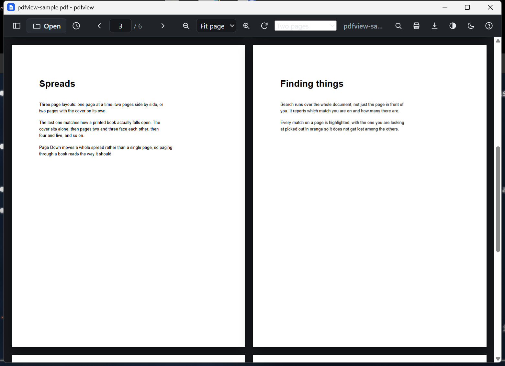
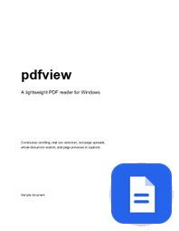

# pdfview

A small, quiet PDF reader for Windows. Its own window, its own icon, and it can
be the program Windows opens PDFs with.



## What it does

- Continuous scrolling. Pages are drawn as they come into view and released when
  they leave, so a nine hundred page file costs about what a short one does.
- Real text. Selectable, copyable, searchable. Links and the outline work.
- Three page layouts: one page, two pages, or two pages with the cover on its
  own, the way a printed book falls open. Page Down moves a whole spread.
- Search across the whole document, with every match on the page highlighted and
  the current one picked out.
- Every file reopens on the page you left it on.
- Light and dark, plus an invert mode for reading white-on-black.
- PDF files get their first page as their icon in Explorer.
- Printing hands the printer the document itself, so the output keeps the
  original vectors and text, with nothing stamped in the margins.

It does not edit, annotate, sign or fill in forms. It reads.

## Install

1. Download the latest release from the
   [releases page](https://github.com/MartyChouette/pdfview/releases).
   - **pdfview-win-x64.zip** runs as is. Take this one if you are not sure.
   - **pdfview-win-x64-framework.zip** is much smaller but needs the
     [.NET 8 Desktop Runtime](https://dotnet.microsoft.com/download/dotnet/8.0)
     installed.
2. Unzip it somewhere you intend to keep it, such as
   `C:\Users\you\Programs\pdfview`.
3. Run **install.cmd**.

`install.cmd` writes only to `HKEY_CURRENT_USER`, so it needs no administrator
rights. It adds a Start Menu shortcut, puts pdfview under **Open with** for PDF
files, and turns on page previews for PDF icons. `uninstall.cmd` undoes all of
it.

Keep the folder where you put it. The registration points at that exact path, so
if you move it, run `install.cmd` again.

### SmartScreen

pdfview is not signed, so Windows flags it as an unknown program.

Right-click the zip, **Properties**, tick **Unblock**, then extract. The files
come out clean. If you extract first, it is **More info** then **Run anyway**.

### Requirements

Windows 10 version 1809 or newer, 64-bit, and the Edge WebView2 runtime, which
ships with Windows 11 and arrives on Windows 10 through Edge. If it is somehow
missing, pdfview says so on startup and Microsoft gives it away
[here](https://developer.microsoft.com/microsoft-edge/webview2/).

## Making it your default PDF reader

Installing puts pdfview on the list. Windows does not let a program promote
itself to default, so the last step is yours:

- **Settings > Apps > Default apps**, search for pdfview, and set it for `.pdf`,
  or
- right-click any PDF, **Open with**, **Choose another app**, pick pdfview and
  tick **Always use this app**.

## Page previews in Explorer



PDF files show their own first page as their icon, with a small badge in the
corner, instead of a generic document symbol. This applies to every PDF,
whatever app opens them.

The page is drawn by `Windows.Data.Pdf`, the PDF renderer built into Windows, so
nothing extra is bundled to do it. Windows runs the handler inside the isolated,
low-privilege host it keeps for exactly this, so a malformed file cannot take
Explorer down with it; the icon just falls back to the plain one.

Windows caches thumbnails per file, so PDFs you have already looked at may keep
their old icon for a while. Clearing the thumbnail cache from Disk Cleanup
forces a redraw.

The thumbnail handler needs the .NET 8 runtime even in the self-contained
download, because a COM server cannot carry its own. Without it the thumbnails
quietly do not appear and nothing else changes.

## Shortcuts

| Key | Action |
| --- | --- |
| `Ctrl+O` | Open a file |
| `Ctrl+F` | Find in document |
| `Enter` / `Shift+Enter` | Next / previous match |
| `Page Down` / `Page Up` | Next / previous page or spread |
| `Home` / `End` | First / last page |
| `Ctrl+G` | Go to page |
| `Ctrl+P` | Print |
| `+` `-` `0` | Zoom in, out, fit width |
| `Ctrl+scroll` | Zoom |
| `D` | Single page / two pages / two pages with cover |
| `R` | Rotate 90 degrees |
| `S` | Sidebar (thumbnails, outline) |
| `T` | Light / dark theme |
| `I` | Invert page colours |
| `F` | Fullscreen |
| `Esc` | Close the find bar, or leave fullscreen |

## Build it yourself

You need the [.NET SDK 8 or newer](https://dotnet.microsoft.com/download).

```
git clone https://github.com/MartyChouette/pdfview
cd pdfview
build.cmd
install.cmd
```

`build.cmd` produces `dist\`. `build.cmd light` produces the smaller
framework-dependent build instead.

Once Explorer has drawn one thumbnail it keeps the handler DLL loaded, which
makes a rebuild fail with "file in use". Run `uninstall.cmd` first.

## How it works

The window is a WinForms shell hosting a WebView2, with
[pdf.js](https://github.com/mozilla/pdf.js) doing the rendering inside it.

Nothing listens on a network port. The viewer's files and the PDF stream are
answered inside the process, at a private `https://pdfview.local` origin that
only this app can reach. The window never navigates anywhere else; a link inside
a PDF opens in your default browser instead.

```
src/PdfView/     the app: window, printing, in-process file serving, registration
src/PdfThumb/    the Explorer thumbnail handler
app/             the viewer front end: index.html, styles.css, viewer.js
vendor/          pdf.js 4.10.38
docs/            screenshot and a sample PDF
```

Recent files, last-read pages and window placement live in
`%USERPROFILE%\.pdfview\state.json`. Theme, zoom, page layout and sidebar state
live in the WebView2 profile under `%LOCALAPPDATA%\pdfview`.

It reads any local file you point it at, which is the point. Treat it as a
program running as you, not as a sandbox.

## Licence

MIT, see [LICENSE](LICENSE).

Rendering is [pdf.js](https://github.com/mozilla/pdf.js) by the Mozilla
Foundation, under the Apache License 2.0. See
[THIRD-PARTY-NOTICES.md](THIRD-PARTY-NOTICES.md).
