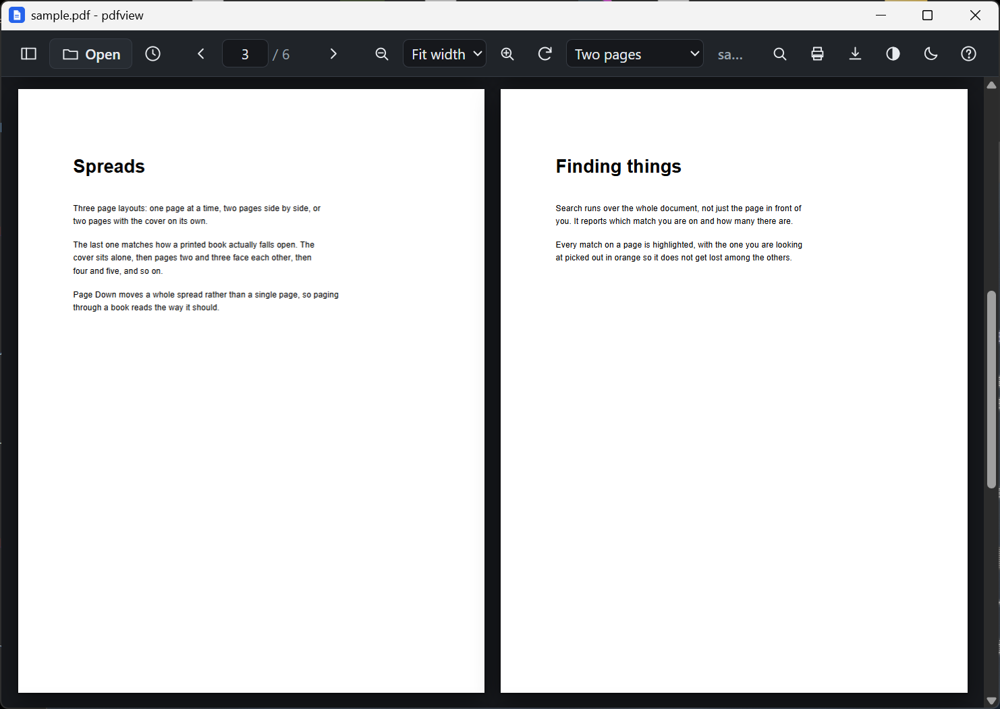
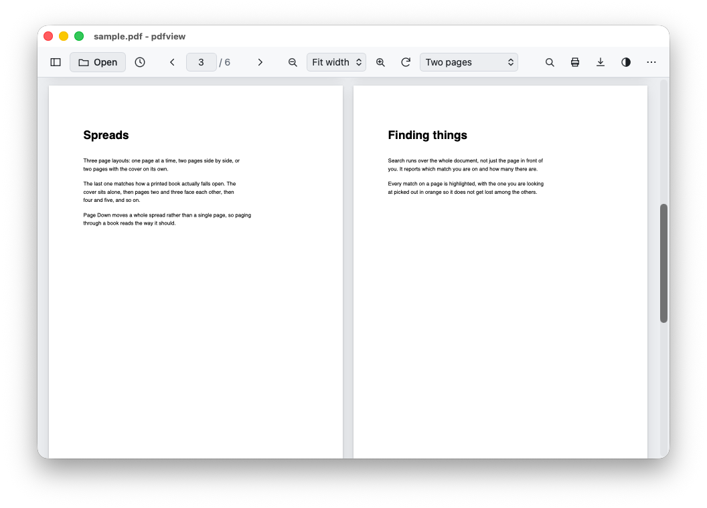
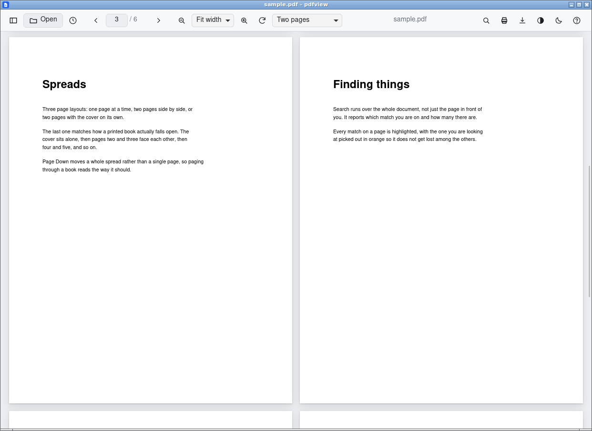
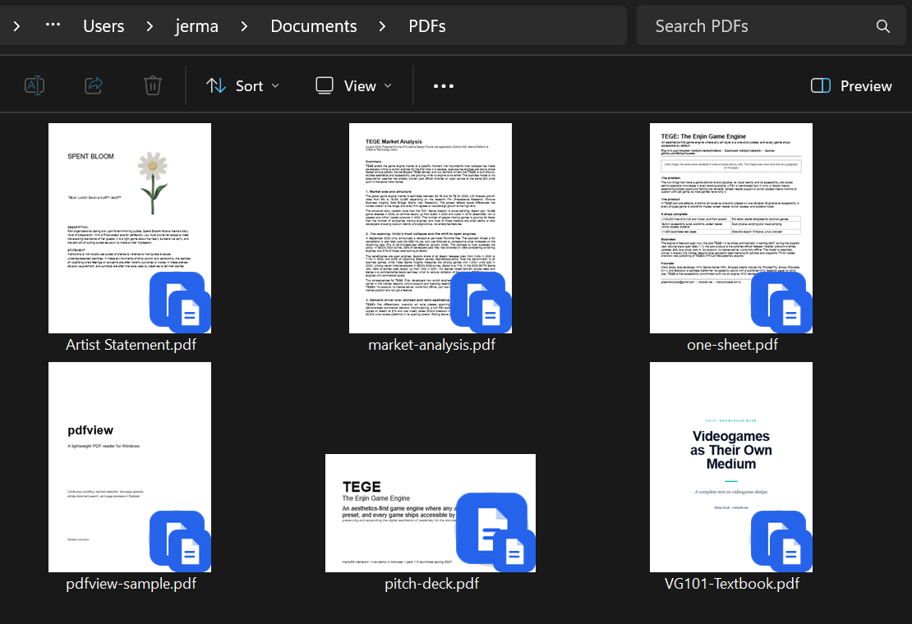

# pdfview


A lightweight PDF reader for Windows, macOS and Linux.

**Windows**



**macOS**



**Linux**



## What it does

- Continuous scrolling, pages drawn as they come into view
- Selectable text, working links and outline
- One page, two pages, or two pages with the cover on its own
- Search across the whole document
- Reopens every file on the page you left it on
- Light, dark, and inverted pages for night reading
- PDF icons in Explorer show the first page (Windows; Finder and the Linux
  file managers already do this themselves)

It does not edit, annotate, sign or fill in forms. It reads.



## Install

### Windows

Download
**[pdfview-1.0.0-win-x64.zip](https://github.com/MartyChouette/pdfview/releases/latest)**,
72 MB with nothing else to install.

1. Right-click the zip, **Properties**, **Unblock**. It is unsigned, so Windows
   flags it until you do.
2. Extract it somewhere you will keep it. The registration points at that path.
3. Run **install.cmd**. It writes only to `HKEY_CURRENT_USER` and needs no
   admin. `uninstall.cmd` undoes it.
4. Make it the default: **Settings > Apps > Default apps**, search for pdfview,
   set it for `.pdf`. Windows does not let a program do that step itself.

Needs Windows 10 1809 or newer and the Edge WebView2 runtime, which is already
on Windows 11.

### macOS

Download the `.dmg` from the
[latest release](https://github.com/MartyChouette/pdfview/releases/latest), open
it and drag pdfview to Applications. One app covers Apple silicon and Intel.
Needs macOS 11 or newer.

To make it the default, select any PDF in Finder, **Get Info**, **Open with**,
choose pdfview, **Change All**.

### Linux

From the same release page, for x64:

- `.deb` for Debian, Ubuntu and Mint: `sudo apt install ./pdfview-*.deb`
- `.rpm` for Fedora and openSUSE: `sudo dnf install ./pdfview-*.rpm`
- `.AppImage` for anything else: `chmod +x` it and run it

It uses the system WebKitGTK (`libwebkit2gtk-4.1`), which the `.deb` and `.rpm`
pull in. To make it the default:
`xdg-mime default pdfview.desktop application/pdf`.

<details>
<summary><b>Shortcuts</b></summary>

On macOS, read `Ctrl` as `Cmd`.

| Key | Action |
| --- | --- |
| `Ctrl+O` | Open a file |
| `Ctrl+F` | Find in document |
| `Enter` / `Shift+Enter` | Next / previous match |
| `Page Down` / `Page Up` | Next / previous page or spread |
| `Home` / `End` | First / last page |
| `Ctrl+G` | Go to page |
| `Ctrl+P` | Print |
| `+` `-` `0` | Zoom in, out, fit width |
| `Ctrl+scroll` | Zoom |
| `D` | Single page / two pages / two pages with cover |
| `R` | Rotate 90 degrees |
| `S` | Sidebar (thumbnails, outline) |
| `T` | Light / dark theme |
| `I` | Invert page colours |
| `F` | Fullscreen |
| `Esc` | Close the find bar, or leave fullscreen |

</details>

## Build

Needs the [.NET SDK 8 or newer](https://dotnet.microsoft.com/download).

```
build.cmd
install.cmd
```

On macOS and Linux it needs [Rust](https://rustup.rs) instead, and on Linux the
WebKitGTK headers listed at the top of the script:

```
sh build.sh
```

The packages land in `src/tauri/target/release/bundle`.

### Signing the macOS build

The release workflow signs and notarises the `.dmg` when these repository
secrets are set, and builds it unsigned when they are not:

| Secret | What it is |
| --- | --- |
| `APPLE_CERTIFICATE` | The Developer ID Application certificate, exported as `.p12` and base64 encoded |
| `APPLE_CERTIFICATE_PASSWORD` | The password set on that export |
| `APPLE_SIGNING_IDENTITY` | Its name, like `Developer ID Application: Your Name (TEAMID)` |
| `APPLE_ID` | The Apple ID email |
| `APPLE_PASSWORD` | An app-specific password for it, from appleid.apple.com |
| `APPLE_TEAM_ID` | The ten character team ID |

## How it works

The viewer is one web front end in `app/`, with
[pdf.js](https://github.com/mozilla/pdf.js) rendering inside it, and a small
native host around it per platform. On Windows the host is a WinForms window
hosting WebView2 (`src/PdfView`). On macOS and Linux it is a
[Tauri](https://tauri.app) window around the system webview, WKWebView and
WebKitGTK (`src/tauri`). Nothing listens on a network port; the viewer's files
and the PDF's bytes are answered inside the process.

Printing on Windows hands the printer the document itself. On macOS and Linux
the webview cannot do that, so pages are drawn at 200 dpi and printed as images.

Explorer thumbnails come from a shell handler in `src/PdfThumb`, drawn by
`Windows.Data.Pdf` and run in the isolated host Windows keeps for the purpose.

## Licence

MIT, see [LICENSE](LICENSE). Rendering is
[pdf.js](https://github.com/mozilla/pdf.js) by the Mozilla Foundation under
Apache 2.0, see [THIRD-PARTY-NOTICES.md](THIRD-PARTY-NOTICES.md).
